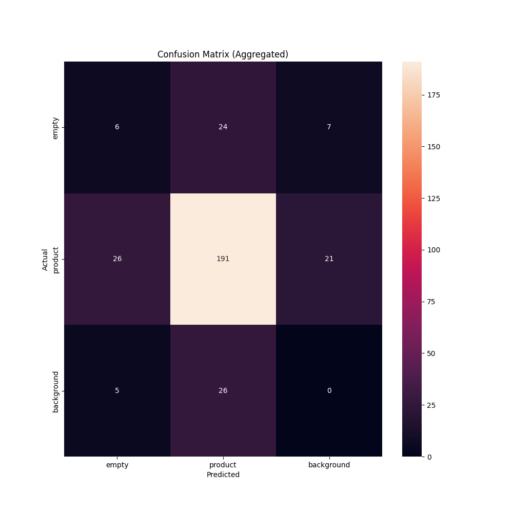
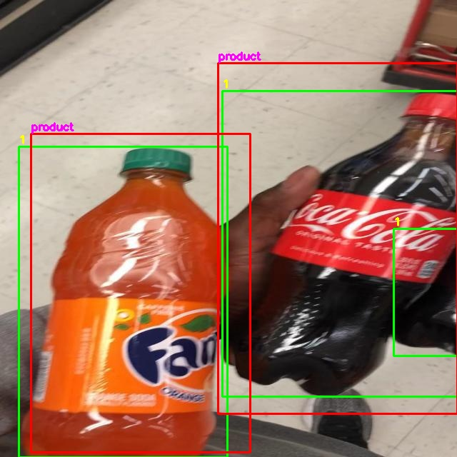

# CV Evaluations 🔎

`cvevals` is a framework for evaluating the results of computer vision models. Think [OpenAI Evals](https://github.com/openai/evals), but for computer vision models.

Roboflow `evaluations` is a Python package for evaluating computer vision models.

Using evaluations, you can:

1. Compare ground truth to a Roboflow model to benchmark and visualize model performance on images in bulk;
2. Test different Grounding DINO prompts to see which one most effectively annotates a specified class in an image;
3. Test different CLIP prompts to see which one most effectively classifies an image, and;
4. Evaluate resuts of different confidence levels for active learning.

Performance is measured using an aggregate of the following metrics:

- **Precision**
- **Recall**
- **F1 Score**

Evaluations works with YOLOv5 PyTorch TXT data for object detection and Multiclass Classification TXT for classification.

This repository contains evaluation code for the following models:

- Roboflow models
- CLIP
- Grounding DINO

## Getting Started

To get started, clone the repository and install the required dependencies:

```bash

git clone https://github.com/roboflow/evaluations.git
cd evaluations
pip install -r requirements.txt
pip install -e .
```

Now you're ready to use this package!

Out of the box, we have created examples that let you evaluate the performance of the following models against your Roboflow datasets:

- CLIP (Classification)
- BLIP (Classification)
- ALBEF (Classification)
- Grounding DINO (Object Detection)

## Examples

### Roboflow Object Detection Evaluation

To evaluate a model hosted on Roboflow, run the `roboflow_example.py` file with the following arguments:

```
python3 examples/roboflow_example.py --eval_data_path <path_to_eval_data> \
--roboflow_workspace_url <workspace_url> \
--roboflow_project_url <project_url> \
--roboflow_model_version <model_version>
```

### CLIP Evaluation

You can run CLIP over images in your validation set to see how well the model performs at zero-shot annotation.

Run the `clip_example.py` file with the following arguments:

```
python3 examples/classification_example.py --eval_data_path=<path_to_eval_data> \ 
--roboflow_workspace_url=<workspace_url> \ 
--roboflow_project_url<project_url> \ 
--roboflow_model_version=<model_version>
```

### BLIP and ALBEF Evaluation

You can use BLIP and ALBEF as a zero-shot labeling model for classification tasks like you would BLIP.

```
python3 examples/blip_albef_example.py --eval_data_path=<path_to_eval_data> \ 
--roboflow_workspace_url=<workspace_url> \ 
--roboflow_project_url<project_url> \ 
--roboflow_model_version=<model_version>
```

To evaluate your data using BLIP, pass the `--feature-extractor=blip` argument. To evaluate your data using ALBEF, pass the `--feature-extractor=albef` argument.

### Grounding DINO Zero-Shot Evaluation

You can use Grounding DINO to test whether Grounding DINO can effectively label a specified class in your Roboflow dataset.

To evaluate your data using Grounding DINO, run the `dino_example.py` file with the following arguments:

```
python3 examples/dino_example.py --eval_data_path=<path_to_eval_data> \ 
--roboflow_workspace_url=<workspace_url> \ 
--roboflow_project_url<project_url> \ 
--roboflow_model_version=<model_version> \
--config_path=<path_to_dino_config_file> \
--weights_path=<path_to_dino_weights_file>
```

### Prompt Evaluation

You can compare different prompts for CLIP and Grounding DINO using the `compare` examples.

To use these examples, open up the appropriate file (i.e. `examples/clip_example.py`) and update the `evals` dictionary with the class names and confidence levels you want to evaluate.

Then, run the script using all of the required arguments. To find the arguments for a script, run the script with no arguments, like so:

```
python3 examples/dino_compare_example.py
```

### Azure Evaluation

We have included an Azure Vision example to help you evaluate the performance of the large vision they offer against your data.

Before you can run the Azure example, you'll need to have an Azure Computer Vision endpoint set up on your Microsoft Azure account.

When you have your account ready, open up the `examples/azure_example.py` file and update the `class_mappings` dictionary with the classes you want to evaluate.

This dictionary should follow this format:

```
"azure_class_name": "roboflow_class_name"
```

For example, if you want to evaluate the performance of a model on the `Person` class from Azure and a `person` class in Roboflow, you would update the dictionary to look like this:

```
class_mappings = {
    "Person": "person"
}
```

This mapping is case sensitive.

Then, run the `azure_example.py` file with the following arguments:

```
python3 examples/azure_example.py --eval_data_path <path_to_eval_data> --roboflow_workspace_url <workspace_url> --roboflow_project_url <project_url> --roboflow_model_version <model_version> --azure_endpoint <azure_endpoint> --azure_api_key <azure_api_key>
```

## Evaluation Results

The script will print the precision, accuracy, and f1 score of the model performance to the console.

An `output/` folder will be created with two subfolders:

1. `images`: Images with ground truth and predictions (only for object detection models)
2. `matrices`: Confusion matrices for each class. `aggregate.png` shows an aggregate confusion matrix for the model.

Here is an example confusion matrix from the `output/matrices` folder:



Here is an example of an image with ground truth and predictions from the `output/images` folder:



### Prompt Comparison

When you compare two prompts and/or confidence levels using the `CompareEvaluations.compare()` function, the results will be printed to the console, like so:


## Notes on Using CLIP, BLIP, ALBEF, and Grounding DINO

### CLIP

When you first run any of the examples that use CLIP, the weights for OpenAI's CLIP model will be downloaded if you do not already have the weights on the system.

### BLIP and ALBEF

To use BLIP or ALBEF, you will need to install the [Salesforce LAVIS](https://github.com/salesforce/LAVIS/) package:

```
pip3 install salesforce-lavis
```

Note: This package will not install on M1 Macs.

### Grounding DINO

To use GroundingDINO, run the `dinosetup.sh` script in the root `evaluations` directory. This will install the model relative to the `evaluations` directory and download the model weights.

## License

This project is licensed under an [MIT License](LICENSE).

## Contributing

Interested in contributing to evaluations? Check out our [contributing guidelines](CONTRIBUTING.md).
